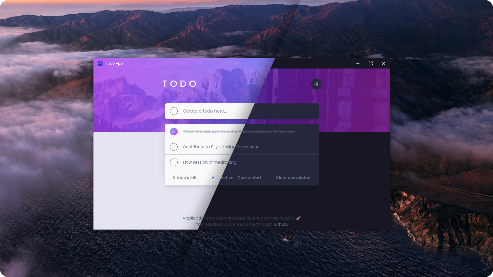

# 🐕 Productivity App

Design inspired from a [todo app on FrontendMentor](https://www.frontendmentor.io/challenges/todo-app-Su1_KokOW).
Frontend Mentor challenges help you improve your coding skills by building real projects.
Built on top of other technologies, more details about them are down below.

This is currently how it looks like:



## Table of contents

- [Overview](#overview)
  - [Challenges](#challenges)
  - [Built with](#built-with)
  - [What I learned](#what-i-learned)
- [Continued development](#continued-development)
  - [Useful resources](#useful-resources)
  - [Misc](#misc)
- [Author](#author)

## Overview

### Challenges

Users should be able to:

- [x] See hover states for all interactive elements on the page
- [x] Add new todos to the list
- [x] Mark todos as complete
- [x] Delete todos from the list
- [x] Filter by all/active/complete todos
- [x] Clear all completed todos
- [x] Toggle light and dark mode
- [ ] **Bonus**: Drag and drop to reorder items on the list

### Built with

| 🛠️ Technologies                                                                                                                                      | 📝 Descriptions                              |
| ---------------------------------------------------------------------------------------------------------------------------------------------------- | -------------------------------------------- |
| [](https://www.solidjs.com/)                | An alternative to React based on reactivity. |
| [](https://www.rust-lang.org/fr)                     | Programming system typed language.           |
| [](https://www.typescriptlang.org/) | Typed JS language.                           |
| [](https://tailwindcss.com/)   | CSS Framework.                               |
| [](https://vitejs.dev/)                              | Next generation front-end tooling.           |
| [](https://tauri.studio/)                          | Desktop framework for building webviews.     |

### What I learned

An Immer inspired utility function called `produce()`. This utility allows us to write code that mutates
data in the normal way but automatically creates immutable copies behind the scenes.

```tsx
export const addTodo = (todo: ITodo) => setTodos(produce((currentTodos: ITodo[]) => currentTodos.push(todo)))
```

Also, [SolidJS considerations](https://www.solidjs.com/guides/reactivity#considerations)
are extremely important to understanad when it specifically comes to
logic top-level structure or props destructuring, see second one.

## Continued development

- More focus on code written in Rust rather than just in plain JS which reduce compilation time.

- Sharing common design for all OS without breaking UI & UX desktop apps best practices and conventions. Keeping track of a user friendly interface avoiding an overload of functionalities.

### Useful resources

- [Tauri Action](https://github.com/tauri-apps/tauri-action) - Alternative to cross-platform compilation which builds Tauri binaries for the 3 most known operating systems.
- [Tauri Docs (Window Module)](https://tauri.app/v1/api/js/modules/window/#appWindow) - Incredibly usefull API for having access to: Events listeners, interfaces, types and methods of the window.

### Misc

A fun cli tool to count lines of code, credits to [theoludwig](https://github.com/theoludwig/theoludwig).

```shell
cloc . --exclude-dir=target,node_modules --exclude-ext=yaml
```

## Author

- My Website - [Walid Korchi](https://www.walidkorchi.com/)
- FrontendMentor - [@Walidoux](https://www.frontendmentor.io/profile/Walidoux)
